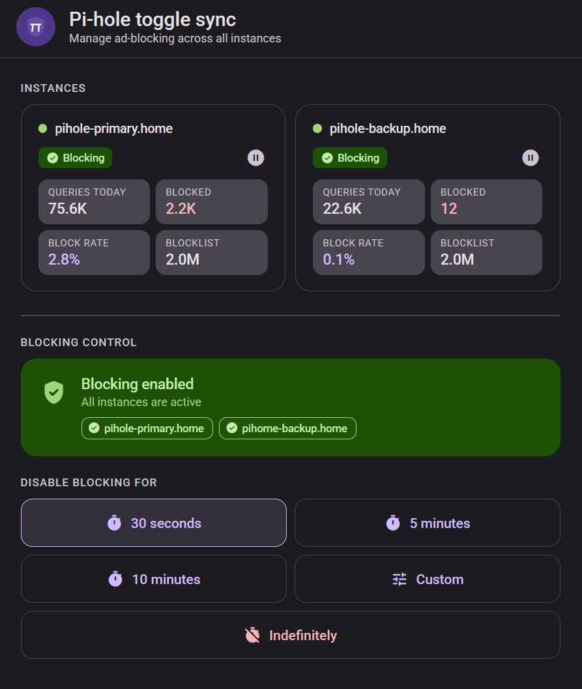
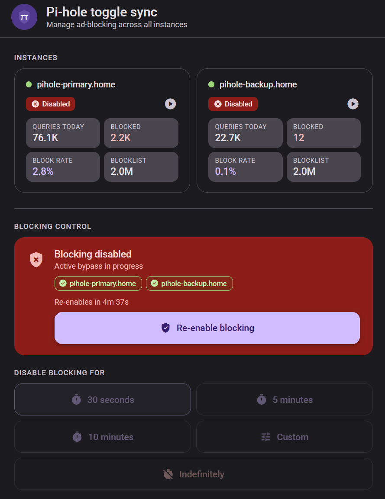

#  Pi-hole Toggle Sync

A lightweight web UI for toggling ad-blocking on one or more [Pi-hole](https://pi-hole.net/) instances simultaneously. Shows live stats per instance and syncs disable/enable actions across all of them at once.


 

---

## Why run redundant Pi-hole instances?

A single Pi-hole is a convenient network-wide ad blocker, but it also becomes a **single point of failure** for all DNS resolution on your network. If it goes down for a reboot, update, or hardware issue, every device on your network loses DNS — and with it, internet access.

Running two (or more) Pi-hole instances in parallel solves this:

- **High availability** — configure your router to hand out both Pi-hole IPs as DNS servers. If one goes down, clients automatically fall back to the other with no interruption.
- **Maintenance without downtime** — update or restart one instance while the other keeps serving queries.
- **Load distribution** — DNS queries are spread across instances, reducing per-instance load on busy networks.
- **Consistency** — both instances should have identical blocklists and settings. Keeping them in sync manually is error-prone; tools like [Nebula Sync](https://github.com/lovelaze/nebula-sync) or Pi-hole's built-in Teleporter can help.

The catch: **any action you take on one instance** — such as temporarily disabling blocking to let a site through — **must be mirrored on the other**, or traffic will simply be blocked by whichever instance the client happens to query. Doing this manually across two browser tabs is tedious and easy to forget.

That is what this tool is for.

---

## Features

- Per-instance info cards showing queries today, blocked count, block rate, and blocklist size
- Disable blocking across all instances at once — for 30s, 5m, 10m, a custom duration, or indefinitely
- Live countdown timer with automatic re-enable
- Per-instance status chips showing which hosts succeeded or failed
- Instance cards refresh automatically every 30 seconds and after each toggle action
- Material Design 3 UI with full dark mode support
- Configurable entirely via environment variables — no build step needed
- Multi-arch image: `amd64`, `arm64`, `armv7` (Raspberry Pi)

## Requirements

- Pi-hole **v6+** (uses the `/api/stats/summary` and `/api/dns/blocking` REST API endpoints)
- Docker + Docker Compose

## Quick start

### Using the pre-built image from GHCR (recommended)

```bash
curl -O https://raw.githubusercontent.com/bartekmp/pihole-toggle-sync/main/compose.yml
curl -O https://raw.githubusercontent.com/bartekmp/pihole-toggle-sync/main/.env.example
mv .env.example .env
nano .env
docker compose up -d
```

The image is published to [GitHub Container Registry](https://ghcr.io/bartekmp/pihole-toggle-sync) and is publicly available without authentication.

### Building from source

```bash
git clone https://github.com/bartekmp/pihole-toggle-sync.git
cd pihole-toggle-sync
cp .env.example .env
nano .env
docker compose up -d
```

Then open `http://<your-host>:8087` in a browser.

## Configuration

All configuration is done at **runtime** via environment variables — the image itself contains no hardcoded addresses. Set them in a `.env` file or directly in `compose.yml`.

| Variable | Default | Description |
|---|---|---|
| `PH_HOSTS` | *(empty)* | Comma-separated list of Pi-hole base URLs. Embed a per-instance password with `http://:password@host` syntax. |
| `PH_PASSWORD` | *(empty)* | Shared Pi-hole password used for instances without an embedded credential. Leave empty if none is set. |
| `LISTEN_PORT` | `8087` | Host port to expose the UI on |

### Example `.env`

```env
# Both instances share one password:
PH_HOSTS=https://pihole.example.com,https://pihole2.example.com
PH_PASSWORD=yourpassword
LISTEN_PORT=8087

# Or give pihole2 its own password:
# PH_HOSTS=https://pihole.example.com,https://:differentpassword@pihole2.example.com
# PH_PASSWORD=yourpassword
```

## CORS and reverse proxy

API calls are made directly from the **browser**, not from the container. This means Pi-hole must be reachable from the browser and must respond with appropriate CORS headers for cross-origin POST requests (used when toggling blocking).

The recommended setup is a reverse proxy (e.g. Caddy) in front of each Pi-hole, which handles CORS and avoids Pi-hole ACL issues:

```
pihole.example.com {
    redir / /admin/ 301

    @api path /api/*
    header @api {
        ?Access-Control-Allow-Origin *
        ?Access-Control-Allow-Methods "GET, POST, OPTIONS"
        ?Access-Control-Allow-Headers "Content-Type, X-FTL-SID"
    }

    @preflight {
        method OPTIONS
        path /api/*
    }
    respond @preflight 204

    reverse_proxy http://127.0.0.1:8053
}
```

If you access Pi-hole directly by IP, ensure its webserver ACL allows your browser's LAN IP:

```yaml
FTLCONF_webserver_acl: "+127.0.0.0/8,+192.168.0.0/24"
```

## How it works

The UI is a single static HTML file served by nginx. On container start, an entrypoint script runs `envsubst` to substitute the `${PH_HOSTS}` and `${PH_PASSWORD}` placeholders in the HTML with runtime environment variable values. The browser then talks directly to each Pi-hole's REST API — there is no backend process.

## Project structure

```
pihole-toggle-sync/
├── .github/
│   └── workflows/
│       └── publish.yml          # CI/CD: build & push to GHCR
├── docker-entrypoint.d/
│   └── 40-envsubst-html.sh      # Injects env vars into HTML at startup
├── www/
│   ├── index.html               # Single-file Material Design 3 UI
│   └── favicon.svg              # App icon
├── Dockerfile                   # nginx:alpine + www/ + entrypoint script
├── nginx.conf                   # Static file server config
├── compose.yml                  # Docker Compose service definition
├── .env.example                 # Example environment file
├── .gitignore
├── LICENSE
└── README.md
```

## License

[MIT](LICENSE)
